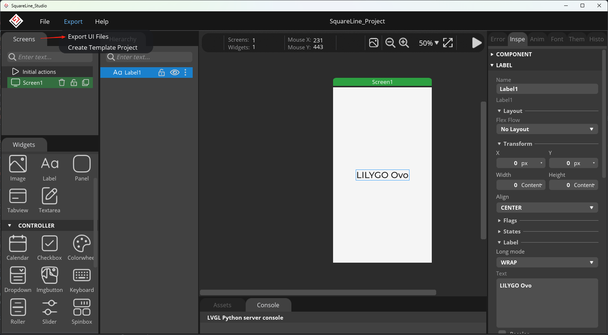
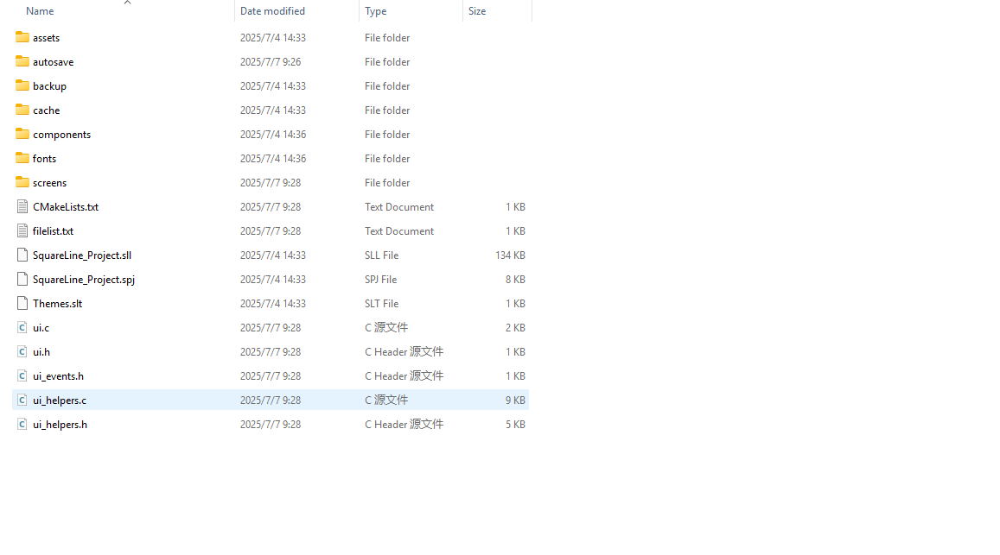
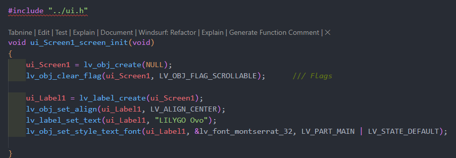
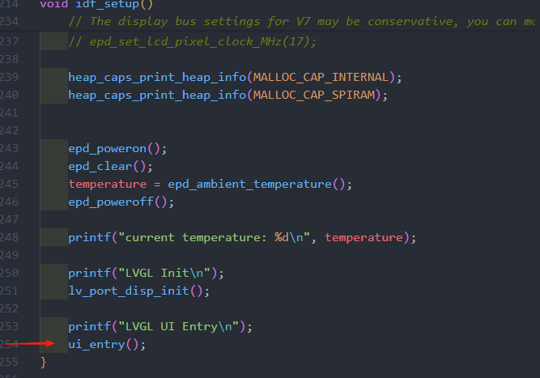
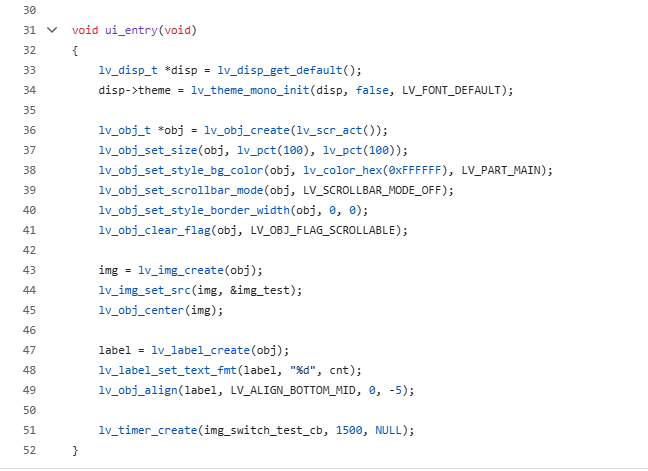
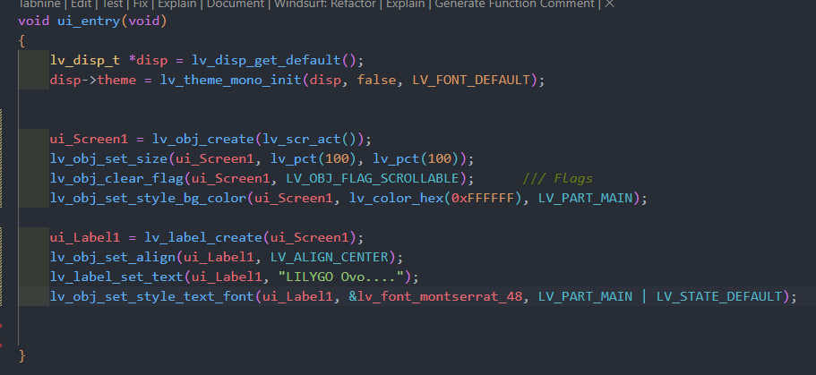
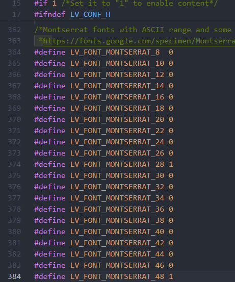
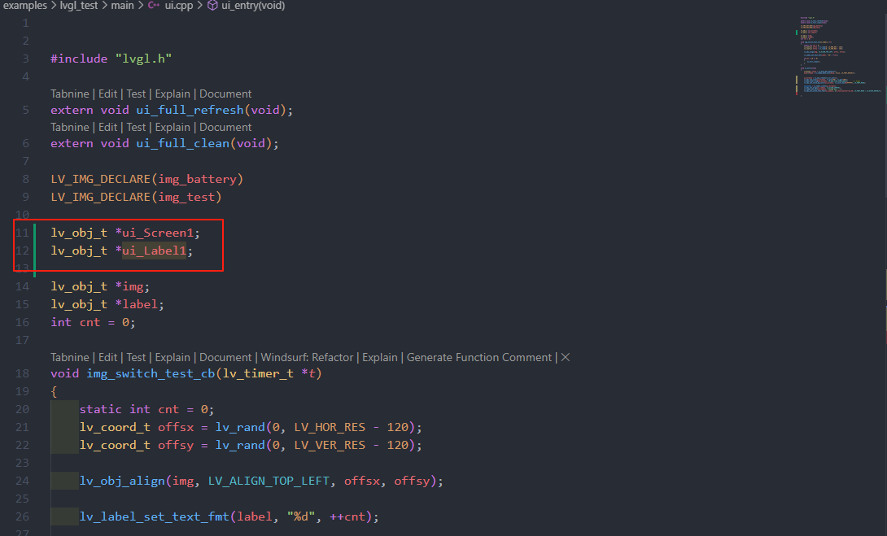

<h1 align = "center">🏆T5_E_Paper_S3_Pro🏆</h1>

# SquareLine Porting Guide

## SquareLine export ui Files

After designing the UI, export the UI files in SquareLine by clicking the menu bar `Export` -> `Export UI Files`.


Locate the directory where the files were saved:


Open the Screens folder:


Here you’ll find the UI interface code generated in SquareLine.

## lvgl_test
Find the ui_entry() function in main.cpp. Inside this function, first call lv_port_disp_init() to initialize LVGL, then call ui_entry() to initialize the UI elements such as buttons, labels, images, etc.



Paste the code generated by SquareLine into the ui_entry() function:



The imported code should look like this:


!!! Some Important Notes

When compilation fails due to a font-related issue, you can resolve it by modifying the lv_conf.h file:

Open lv_conf.h and set the desired font macro (e.g., LV_FONT_MONTSERRAT_xx) from 0 to 1:



font.png
You need to manually initialize ui_Screen1, ui_Label1, and other UI components during import:



```
    lv_disp_t *disp = lv_disp_get_default();
    disp->theme = lv_theme_mono_init(disp, false, LV_FONT_DEFAULT);
```
Since the T5_E_Paper_S3_Pro display is an e-paper screen with only black and white colors, we must use a monochrome theme.

```
    ui_Screen1 = lv_obj_create(lv_scr_act());
    lv_obj_set_size(ui_Screen1, lv_pct(100), lv_pct(100));
    lv_obj_clear_flag(ui_Screen1, LV_OBJ_FLAG_SCROLLABLE);      /// Flags
    lv_obj_set_style_bg_color(ui_Screen1, lv_color_hex(0xFFFFFF), LV_PART_MAIN);
```
The first line creates ui_Screen1 on the active screen layer.

The second line sets its size to 100%.

The third line disables scrollbars (optional).

The fourth line sets the background color of ui_Screen1 to white.

Please refer to the LVGL documentation for more details about object layers. This guide offers executable ideas you can adapt based on your project’s specific needs.